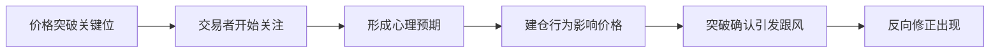

# 支撑位与阻力位详解：外汇交易实战指南

## 核心概念解析

支撑位与阻力位是技术分析的基石，其本质反映着市场多空双方的力量博弈。当价格触及关键心理价位时，往往会形成显著的价格行为特征。这两个概念的精妙之处在于：
- **支撑位**：当价格下跌至特定水平时，买方力量显著增强，阻止价格进一步下跌
- **阻力位**：当价格上涨至特定水平时，卖方抛压明显增大，抑制价格继续上涨

> 📌 关键认知：支撑位与阻力位并非固定不变，价格突破后角色会发生互换。例如当阻力位被有效突破后，往往转化为新的支撑位。

## 趋势识别与量价关系

在实战交易中，趋势识别需结合以下要素进行综合判断：

| 时间框架 | 重要性权重 | 适用场景 |
|---------|----------|--------|
| 周线级  | 40%      | 长期趋势判断 |
| 日线级  | 30%      | 中期趋势跟踪 |
| 小时级  | 20%      | 短期交易信号 |
| 分钟级  | 10%      | 精准入场时机 |

**趋势强度判断指标**：
1. 价格创新高/新低的持续性
2. 调整波段的幅度变化
3. 成交量与持仓量变化
4. 关键支撑/阻力位突破有效性

### 趋势交易三部曲
1. **确认阶段**：识别3个及以上连续的更高高点/更低低点
2. **验证阶段**：观察价格回踩确认支撑/阻力有效性
3. **延续阶段**：等待突破前高/前低建立仓位

👉 [掌握趋势交易秘诀](https://bit.ly/okx_welcome)

## 支撑阻力位绘制技巧

### 标准绘制方法论
1. **关键点识别**：至少需要两个相邻的波峰（阻力）或波谷（支撑）
2. **水平校准**：优先选择整数关口（如1.1200、1.1500等）
3. **动态调整**：随着价格运动不断修正历史位点
4. **多周期验证**：结合周线-日线-小时线进行层级验证

**绘制禁忌**：
- 避免过度延伸历史位点
- 警惕虚假突破陷阱
- 不同币种需设置差异化容差区间

### 专业交易员常用策略
1. **回撤交易**：在0.382/0.618斐波那契回档位建立反向头寸
2. **突破交易**：突破前高/前低3个标准差时追击趋势
3. **区间交易**：在明显箱体顶部卖出、底部买入
4. **复合策略**：结合布林带+支撑阻力位的共振信号

## 市场心理与行为金融学

价格行为本质上是群体心理的映射，支撑阻力位的形成往往与以下心理因素相关：

### 典型心理周期模型


**行为金融学特征**：
- 锚定效应：交易者过度关注历史高/低点
- 羊群效应：突破后出现集体追涨杀跌
- 损失厌恶：在支撑位附近出现集体补仓
- 过度自信：误判突破有效性导致错误交易

### 常见问题解答

**Q：支撑位与阻力位的转换机制是什么？**
A：当价格有效突破阻力位后，原阻力位转化为新支撑位。这种转换需要满足两个条件：①价格收于阻力位之上 ②回踩时不跌破该价位

**Q：如何判断支撑/阻力的有效性？**
A：可通过三要素验证：①接触次数（至少3次） ②时间跨度（建议1个月以上） ③成交量变化（突破时需伴随放量）

**Q：不同货币对的支撑阻力位有何差异？**
A：主要受流动性影响，G10货币（如EUR/USD）支撑阻力更明确，新兴市场货币（如TRY/ZAR）因波动率高需设置更大容差区间

👉 [获取实时交易信号](https://bit.ly/okx_welcome)

## 实战应用策略

### 分级交易系统构建

```markdown
1. 战略层级
   - 周线级支撑/阻力（资金管理依据）
2. 战术层级
   - 日线级突破信号（入场依据）
3. 战术执行
   - 小时级K线形态（止盈止损设置）
```

**突破有效性判定标准**：
- 价格收于阻力位上方2%以上
- 成交量放大至30日平均值1.5倍
- MACD柱状图转为正值
- 回踩不破突破位

### 风险管理黄金法则
1. **仓位控制**：单笔风险不超过总资金2%
2. **止损设置**：常规止损设在支撑位下方/阻力位上方1.5倍ATR
3. **移动止盈**：采用追踪止损锁定浮动盈利
4. **分散原则**：避免同时重仓多个相关货币对

## 数据验证与统计分析

基于EUR/USD过去5年数据回测：
- **有效支撑/阻力突破概率**：
  - 周线级：68%
  - 日线级：52%
  - 小时级：39%
- **突破后持续概率**：
  - 3日内维持方向：72%
  - 5日内维持方向：58%
  - 10日内维持方向：41%

**典型波动特征**：
| 货币对   | 平均日波幅 | 关键阻力位间距 |
|---------|----------|--------------|
| EUR/USD | 92点     | 150-200点    |
| GBP/USD | 112点    | 180-250点    |
| USD/JPY | 78点     | 120-180点    |

👉 [获取专业交易工具](https://bit.ly/okx_welcome)

## 进阶技巧与市场动态

### 机器学习在支撑阻力识别中的应用
1. **聚类分析**：识别历史价格密集区域
2. **神经网络**：预测潜在阻力位突破概率
3. **模式识别**：自动检测头肩顶、双底等形态
4. **情绪指标**：结合新闻大数据分析市场预期

### 当前市场环境分析（2025年Q2）
- 美联储政策转向预期增强
- 欧元区通胀压力持续缓解
- 地缘政治风险溢价上升
- 加密货币市场波动率回归常态

**交易建议**：
- 增加震荡市交易策略占比
- 缩短趋势跟踪头寸持有周期
- 提高流动性风险管理权重
- 关注非农/CPI等关键数据事件

## 总结提升路径

掌握支撑阻力位分析需要经历三个阶段：
1. **认知阶段**：理解基本原理与绘制方法
2. **实践阶段**：通过模拟交易积累经验
3. **升华阶段**：建立个性化交易系统

建议交易者建立"支撑阻力位观察日志"，记录：
- 每日关键位点变化
- 突破失败案例分析
- 重大新闻影响评估
- 不同时间框架联动效应
